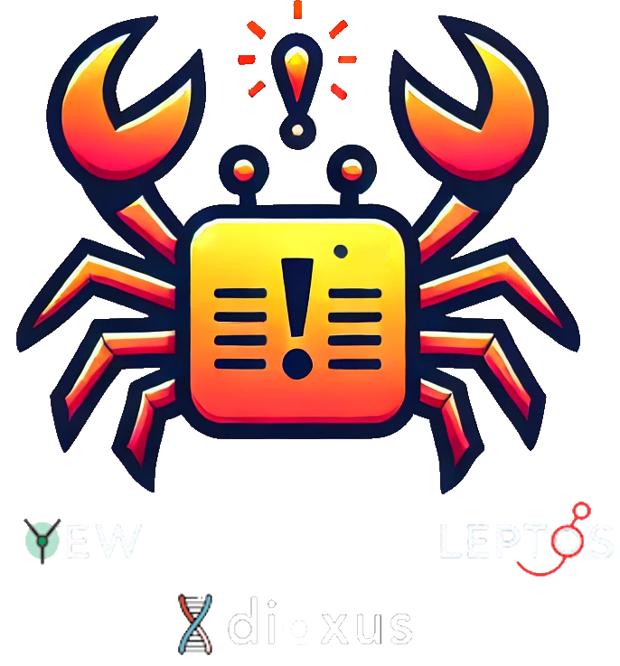

# ⚠️ Alert RS

## 🎬 Demo

## 📜 Intro

`Alert-RS` is a highly customizable alert component designed for Wasm-based frameworks like **Yew**, **Dioxus**, and **Leptos**. Create fully-featured, styled alerts with configurable behaviors like auto-close, button actions, and customizable icons, all within your Rust-based frontend.

## 🤔 Why Use Alert-RS?

The following are some reasons why Alert-RS is a fantastic addition to your Wasm projects:

1. **🚨 Custom Alerts**: Create fully customizable alert boxes with title, message, and buttons.
1. **🎨 Styling Flexibility**: Customize every element with CSS classes and inline styles.
1. **⚡ Button Actions**: Display and handle buttons like Confirm, Cancel, and Close with callback support.
1. **⏲️ Auto-Close**: Optionally auto-close the alert after a timeout.
1. **🔧 Highly Configurable**: Control alert position, icon type, and visibility based on scroll position.

## Y Yew Usage

Refer to [our guide](YEW.md) to integrate this component into your Yew app.

## 🧬 Dioxus Usage

Refer to [our guide](DIOXUS.md) to integrate this component into your Dioxus app.

## 🌱 Leptos Usage

Refer to [our guide](LEPTOS.md) to integrate this component into your Leptos app.

## 🤝 Contributions

Contributions are welcome! Whether it's bug fixes, feature requests, or examples, we would love your help to make Alert-RS better.

1. Fork the repository.
1. Create a new branch for your feature/bugfix.
1. Submit a pull request for review.

## 📜 License

Alert-RS is licensed under the [MIT License](LICENSE). You are free to use, modify, and distribute this library in your projects.
